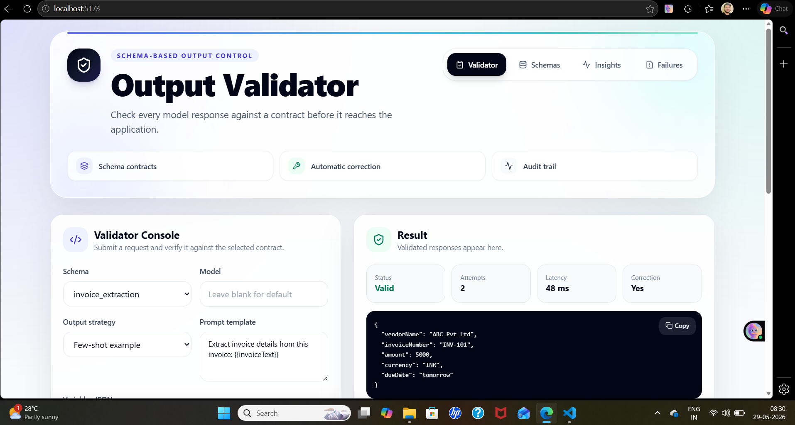
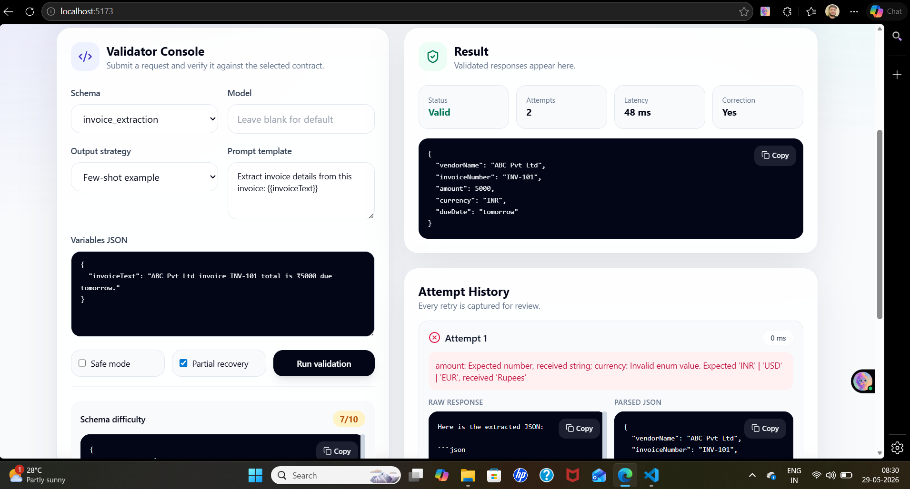
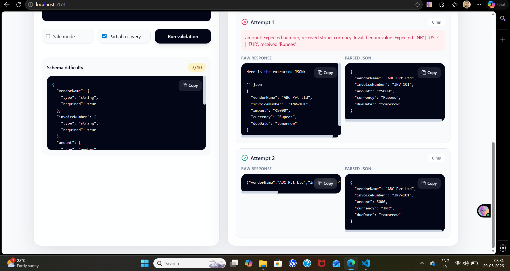
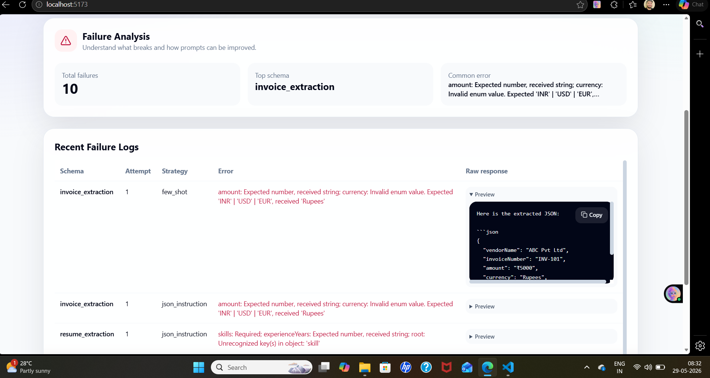
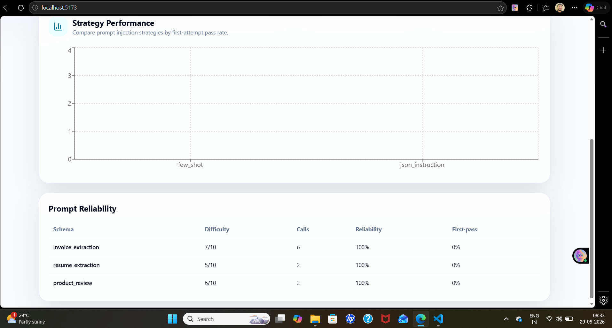
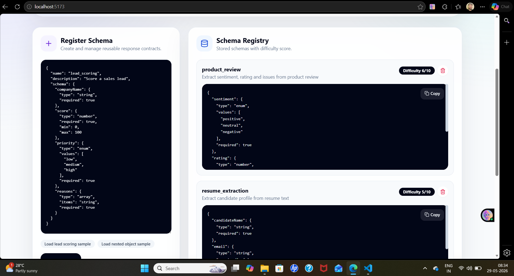

# LLM_OUTPUT_VALIDATOR

A full-stack system for validating structured LLM responses before they are used by downstream applications.

The application accepts a schema, prompt, variables, model configuration, and output strategy. It calls a language model, extracts JSON from the response, validates it with Zod, retries invalid responses with a correction prompt, logs failed attempts, and exposes reliability metrics through a dashboard.

---

## Why this project exists

LLM responses are not always safe to use directly in production workflows. A model can return JSON wrapped inside markdown, add explanation text, miss required fields, rename keys, return numbers as strings, or include extra properties that break downstream code.

This project solves that problem by enforcing one rule:

> No model response is treated as valid until it passes the selected schema contract.

---

## Key capabilities

* Reusable schema registry
* Dynamic Zod validation from stored schema definitions
* Prompt variable rendering
* Multiple output strategies
* JSON extraction from messy model responses
* Automatic correction retry flow
* Strict rejection of extra fields
* Failure logging for invalid attempts
* Metrics dashboard for reliability tracking
* Attempt history for debugging each validation run
* SQLite persistence for local development
* Groq/OpenAI-compatible provider support
* Mock provider for local development and repeatable testing

---

## Screenshots

### Validator Console



### Validation Result



### Attempt History



### Schema Registry



### Insights Dashboard



### Failure Analysis



---

## Tech stack

### Backend

* Node.js
* Express
* TypeScript
* Zod
* Prisma
* SQLite
* Groq/OpenAI-compatible chat completions
* Native tool/function calling support
* Vitest

### Frontend

* React
* Vite
* TypeScript
* Tailwind CSS
* Recharts
* Lucide icons

---

## Architecture

```txt
React Client
     ↓
Express API
     ↓
Schema Registry
     ↓
Prompt Renderer
     ↓
Output Strategy Builder
     ↓
LLM Provider Layer
     ↓
JSON Extraction
     ↓
Zod Validation
     ↓
Valid? ── Yes → Return validated output
     ↓ No
Correction Prompt
     ↓
Retry up to 3 attempts
     ↓
Failure Logging + Metrics
     ↓
SQLite Database
```

---

## Core workflow

1. A schema is registered and stored in the schema registry.
2. The user sends a prompt, schema name, variables, strategy, and model configuration.
3. The backend renders variables such as `{{invoiceText}}` or `{{resumeText}}`.
4. The selected output strategy prepares the model request.
5. The model response is parsed and cleaned.
6. The parsed JSON is validated against a generated Zod schema.
7. If validation passes, the validated output is returned.
8. If validation fails, the system retries with a correction prompt.
9. If all attempts fail, the API returns a structured failure response and logs each failed attempt.

---

## Output strategies

### JSON instruction

Adds direct instructions asking the model to return only JSON matching the selected schema. This is simple and useful for smaller schemas.

### Few-shot example

Adds a generated example output based on the selected schema. This helps with arrays, enum fields, nested fields, and stricter response formatting.

### Tool calling

For Groq/OpenAI-compatible providers, the schema definition is converted into JSON Schema and sent as a native tool/function calling contract. The backend then reads the returned tool arguments and validates them again before returning the final output.

---

## Validation and correction

When a response fails validation, the retry prompt includes:

* the exact validation error,
* the previous invalid response,
* the expected schema,
* clear instructions to return only valid JSON.

Example validation issue:

```txt
amount: Expected number, received string
currency: Invalid enum value. Expected 'INR' | 'USD' | 'EUR', received 'Rupees'
```

The correction attempt receives this error and tries to repair the response. If the repaired response passes validation, it is returned. If not, the system continues retrying until the attempt limit is reached.

---

## Failure logging

Every failed validation attempt is stored, even if a later retry succeeds.

Failure records include:

* schema name,
* rendered prompt,
* model,
* output strategy,
* raw response,
* validation error,
* attempt number,
* timestamp.

This makes it easier to understand recurring response problems and improve prompts or schemas.

---

## Metrics

The dashboard tracks:

* total validation calls,
* successful calls,
* failed calls,
* success rate,
* first-attempt pass rate,
* correction rate,
* average attempts,
* average latency,
* strategy performance,
* schema-level reliability.

---

## Project structure

```txt
LLM_OUTPUT_VALIDATOR/
├── backend/
│   ├── prisma/
│   │   └── schema.prisma
│   ├── examples/
│   └── src/
│       ├── controllers/
│       ├── db/
│       ├── middleware/
│       ├── prompts/
│       ├── routes/
│       ├── services/
│       ├── types/
│       ├── utils/
│       └── __tests__/
├── frontend/
│   └── src/
│       ├── api/
│       ├── components/
│       ├── pages/
│       └── types/
├── screenshots/
├── README.md
├── WINDOWS_SETUP.md
├── package.json
├── pnpm-lock.yaml
└── pnpm-workspace.yaml
```

---

## Local setup

This project uses `pnpm`.

### 1. Install dependencies

From the project root:

```powershell
pnpm install
```

If `pnpm` asks to approve build scripts, approve:

```txt
@prisma/client
@prisma/engines
prisma
esbuild
```

### 2. Configure environment

```powershell
cd backend
copy .env.example .env
```

The default environment uses the local mock provider.

To use Groq, update `backend/.env`:

```env
LLM_PROVIDER="groq"
GROQ_API_KEY="your_groq_api_key"
GROQ_BASE_URL="https://api.groq.com/openai/v1"
GROQ_MODEL="llama-3.1-8b-instant"
```

### 3. Create database and seed schemas

```powershell
pnpm prisma generate
pnpm prisma migrate dev --name init
pnpm run seed
```

### 4. Start the application

From the project root:

```powershell
pnpm run dev
```

Backend:

```txt
http://localhost:4000
```

Frontend:

```txt
http://localhost:5173
```

---

## Useful commands

Run tests:

```powershell
pnpm run test
```

Build project:

```powershell
pnpm run build
```

Seed example schemas:

```powershell
pnpm run seed
```

---

## API examples

### Register schema

```http
POST /api/schemas
Content-Type: application/json
```

```json
{
  "name": "invoice_extraction",
  "description": "Extract invoice fields",
  "schema": {
    "vendorName": { "type": "string", "required": true },
    "invoiceNumber": { "type": "string", "required": true },
    "amount": { "type": "number", "required": true, "min": 0 },
    "currency": {
      "type": "enum",
      "values": ["INR", "USD", "EUR"],
      "required": true
    },
    "dueDate": { "type": "string", "required": false }
  }
}
```

### Validate model output

```http
POST /api/call
Content-Type: application/json
```

```json
{
  "schemaName": "invoice_extraction",
  "prompt": "Extract invoice details from this invoice: {{invoiceText}}",
  "variables": {
    "invoiceText": "ABC Pvt Ltd invoice INV-101 total is ₹5000 due tomorrow."
  },
  "strategy": "few_shot",
  "maxAttempts": 3,
  "safeMode": false,
  "partialRecovery": true
}
```

### Get failure logs

```http
GET /api/failures
```

### Get metrics

```http
GET /api/metrics
```

---

## Example schemas

The project includes seeded schemas for:

* invoice extraction,
* resume extraction,
* product review analysis.

Additional schemas can be created from the Schema Registry page.

---

## Testing

Backend tests cover:

* JSON extraction,
* markdown-wrapped JSON extraction,
* dynamic Zod schema generation,
* strict extra-field rejection,
* enum validation,
* prompt variable rendering,
* schema formatting,
* JSON Schema conversion,
* validation success and failure cases,
* correction retry flow,
* complete retry exhaustion.

Run tests:

```powershell
cd backend
pnpm test
```

---

## Implementation notes

### SQLite-safe JSON storage

SQLite is used for local development. Since Prisma SQLite does not support native `Json` fields in this setup, JSON-like values are stored as strings and hydrated back into objects in the service layer.

Stored JSON-like fields include:

* schema definitions,
* variables,
* token usage,
* validated output,
* warnings,
* parsed attempt JSON.

### Strict validation

Generated Zod schemas use strict object validation, so unexpected fields are rejected instead of silently accepted.

### Safe mode

Safe mode discourages guessing. It is useful when missing information should remain missing instead of being inferred.

### Partial recovery

Partial recovery can preserve valid required data when an invalid optional top-level field can be safely removed.

---

## Known limitations

* Partial recovery currently handles optional top-level fields only.
* SQLite is used for local development; PostgreSQL would be better for a larger deployment.
* Authentication and multi-tenant access control are not included.
* Provider failures before a model response is returned are not stored as validation attempts.
* JSON extraction handles common model responses, but it is not a streaming parser.

---

## License

This project is intended for educational and portfolio use.
